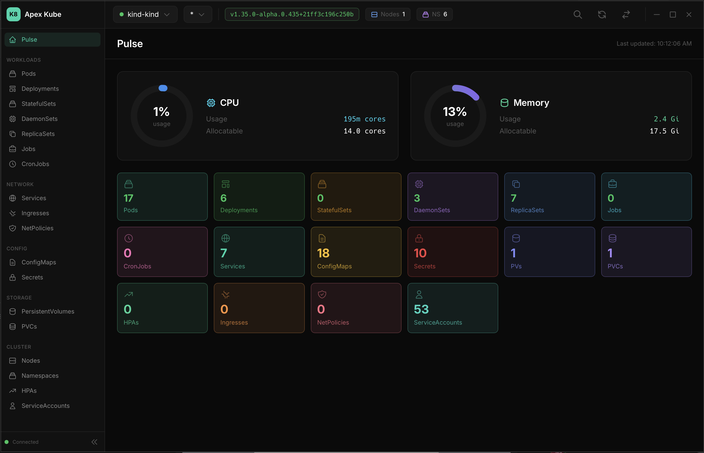

<a id="readme-top"></a>

<!-- PROJECT LOGO -->
<br />
<div align="center">
  <h1>Apex Kube Manager</h1>

  [](https://github.com/talnetd/apex-kube-manager/actions/workflows/release.yml)

  <p>
    A fast, native desktop application for managing Kubernetes clusters.
    <br />
    Built with Tauri 2, Svelte 5, and Rust.
    <br />
    <br />
    <a href="https://github.com/talnetd/apex-kube-manager/releases"><strong>Download Latest Release »</strong></a>
    <br />
    <br />
    <a href="#features">Features</a>
    ·
    <a href="https://github.com/talnetd/apex-kube-manager/issues/new?labels=bug">Report Bug</a>
    ·
    <a href="https://github.com/talnetd/apex-kube-manager/issues/new?labels=enhancement">Request Feature</a>
  </p>
</div>

<!-- TABLE OF CONTENTS -->
<details>
  <summary>Table of Contents</summary>
  <ol>
    <li><a href="#about-the-project">About The Project</a></li>
    <li><a href="#built-with">Built With</a></li>
    <li><a href="#download">Download</a></li>
    <li><a href="#prerequisites">Prerequisites</a></li>
    <li><a href="#features">Features</a></li>
    <li><a href="#usage">Usage</a></li>
    <li><a href="#roadmap">Roadmap</a></li>
    <li><a href="#contributing">Contributing</a></li>
    <li><a href="#license">License</a></li>
    <li><a href="#acknowledgments">Acknowledgments</a></li>
  </ol>
</details>

<!-- ABOUT THE PROJECT -->
## About The Project

No Electron. No bundled Chromium. Just a ~15MB native app that connects directly to your Kubernetes clusters.

Apex Kube Manager provides a clean, fast interface for everyday Kubernetes operations - viewing resources, reading logs, exec into pods, scaling deployments, and port forwarding - without the overhead of browser-based tools.

<p align="center">
  
</p>

<p align="right">(<a href="#readme-top">back to top</a>)</p>

## Built With

[![Tauri][Tauri]][Tauri-url]
[![Svelte][Svelte.dev]][Svelte-url]
[![Rust][Rust]][Rust-url]
[![TailwindCSS][TailwindCSS]][TailwindCSS-url]

<p align="right">(<a href="#readme-top">back to top</a>)</p>

<!-- DOWNLOAD -->
## Download

Download from [GitHub Releases](https://github.com/talnetd/apex-kube-manager/releases):

| Platform | File |
|----------|------|
| macOS (Apple Silicon) | `Apex.Kube.Manager_x.x.x_aarch64.dmg` |
| macOS (Intel) | `Apex.Kube.Manager_x.x.x_x64.dmg` |
| Linux | `.AppImage` or `.deb` |
| Windows | `.msi` or `.exe` |

### macOS First Launch

macOS blocks unsigned apps. On first launch:

1. **Right-click** the app in Applications
2. Select **Open**
3. Click **Open** in the dialog

Or remove quarantine via Terminal:
```bash
xattr -cr /Applications/Apex\ Kube\ Manager.app
```

<p align="right">(<a href="#readme-top">back to top</a>)</p>

<!-- PREREQUISITES -->
## Prerequisites

- Valid kubeconfig at `~/.kube/config`
- For cloud clusters: respective CLI (aws-cli, gcloud, az) for authentication

Verify setup:
```bash
kubectl cluster-info
```

<p align="right">(<a href="#readme-top">back to top</a>)</p>

<!-- FEATURES -->
## Features

### Resource Views

| Workloads | Network | Config | Storage | Cluster |
|-----------|---------|--------|---------|---------|
| Pods | Services | ConfigMaps | PVs | Namespaces |
| Deployments | Ingresses | Secrets | PVCs | Nodes |
| StatefulSets | NetworkPolicies | HPAs | | ServiceAccounts |
| DaemonSets | | | | |
| ReplicaSets | | | | |
| Jobs | | | | |
| CronJobs | | | | |

### Operations

- **Pod exec** - Shell into pods (sh, bash, ash, zsh)
- **Pod logs** - Stream with search, download, previous container
- **Scale** - Deployments and StatefulSets
- **Restart** - Rolling restart
- **Delete** - With confirmation
- **Port Forward** - Forward to Pods and Services with connection stats

### Keyboard Shortcuts

| Shortcut | Action |
|----------|--------|
| `⌘K` | Global search across all resources |
| `⌘P` | Open port forward panel |

### Multi-cluster

- Context switching via dropdown
- Detail windows lock to their original context
- Auto-detects external context changes (kubectx)
- WSL kubeconfig auto-detection on Windows

<p align="right">(<a href="#readme-top">back to top</a>)</p>

<!-- USAGE -->
## Usage

1. Launch the app
2. Select context (top-left dropdown)
3. Select namespace to filter (or `*` for all)
4. Click any row to open detail view
5. Use action buttons for operations

### Troubleshooting

<details>
<summary>App doesn't connect</summary>

1. Verify: `kubectl get nodes`
2. Check kubeconfig: `~/.kube/config`
3. For EKS/GKE/AKS: ensure CLI tools in PATH
</details>

<details>
<summary>Windows: Copy kubeconfig from WSL</summary>

To use your WSL kubeconfig with the Windows app:
```bash
# Run from WSL
mkdir -p /mnt/c/Users/$(whoami)/.kube && cp ~/.kube/config /mnt/c/Users/$(whoami)/.kube/config
```
</details>

<details>
<summary>Exec doesn't work</summary>

1. Verify: `kubectl exec -it <pod> -- /bin/sh`
2. Some images only have `/bin/sh`
</details>

<p align="right">(<a href="#readme-top">back to top</a>)</p>

<!-- ROADMAP -->
## Roadmap

- [x] 17 resource type views
- [x] Pod logs with search and download
- [x] Pod exec terminal
- [x] Deployment/StatefulSet scaling and restart
- [x] Global search (⌘K)
- [x] Port forwarding with connection stats
- [x] WSL kubeconfig detection
- [ ] YAML editing
- [ ] Real-time watch streams (K8s watch API)
- [ ] Dark/Light theme toggle

See the [open issues](https://github.com/talnetd/apex-kube-manager/issues) for a full list of proposed features and known issues.

<p align="right">(<a href="#readme-top">back to top</a>)</p>

<!-- CONTRIBUTING -->
## Contributing

Contributions are what make the open source community amazing. Any contributions you make are **greatly appreciated**.

1. Fork the Project
2. Create your Feature Branch (`git checkout -b feature/AmazingFeature`)
3. Commit your Changes (`git commit -m 'Add some AmazingFeature'`)
4. Push to the Branch (`git push origin feature/AmazingFeature`)
5. Open a Pull Request

### Building from Source

```bash
# Install frontend dependencies
npm install

# Development mode
npm run tauri dev

# Production build
npm run tauri build
```

**Alternative**: Use Tauri CLI directly via cargo:
```bash
cargo install tauri-cli  # One-time setup
cargo tauri dev          # Development mode
cargo tauri build        # Production build
```

See [CLAUDE.md](CLAUDE.md) for detailed architecture documentation.

<p align="right">(<a href="#readme-top">back to top</a>)</p>

<!-- LICENSE -->
## License

Distributed under the MIT License. See [LICENSE](LICENSE) for more information.

<p align="right">(<a href="#readme-top">back to top</a>)</p>

<!-- ACKNOWLEDGMENTS -->
## Acknowledgments

* [kube-rs](https://github.com/kube-rs/kube) - Kubernetes client for Rust
* [xterm.js](https://xtermjs.org/) - Terminal emulator for pod exec
* [Best-README-Template](https://github.com/othneildrew/Best-README-Template)

<p align="right">(<a href="#readme-top">back to top</a>)</p>

<!-- MARKDOWN LINKS & IMAGES -->
[contributors-shield]: https://img.shields.io/github/contributors/talnetd/apex-kube-manager.svg?style=for-the-badge
[contributors-url]: https://github.com/talnetd/apex-kube-manager/graphs/contributors
[forks-shield]: https://img.shields.io/github/forks/talnetd/apex-kube-manager.svg?style=for-the-badge
[forks-url]: https://github.com/talnetd/apex-kube-manager/network/members
[stars-shield]: https://img.shields.io/github/stars/talnetd/apex-kube-manager.svg?style=for-the-badge
[stars-url]: https://github.com/talnetd/apex-kube-manager/stargazers
[issues-shield]: https://img.shields.io/github/issues/talnetd/apex-kube-manager.svg?style=for-the-badge
[issues-url]: https://github.com/talnetd/apex-kube-manager/issues
[license-shield]: https://img.shields.io/github/license/talnetd/apex-kube-manager.svg?style=for-the-badge
[license-url]: https://github.com/talnetd/apex-kube-manager/blob/master/LICENSE

[Tauri]: https://img.shields.io/badge/Tauri-24C8D8?style=for-the-badge&logo=tauri&logoColor=white
[Tauri-url]: https://tauri.app/
[Svelte.dev]: https://img.shields.io/badge/Svelte-4A4A55?style=for-the-badge&logo=svelte&logoColor=FF3E00
[Svelte-url]: https://svelte.dev/
[Rust]: https://img.shields.io/badge/Rust-000000?style=for-the-badge&logo=rust&logoColor=white
[Rust-url]: https://www.rust-lang.org/
[TailwindCSS]: https://img.shields.io/badge/Tailwind_CSS-38B2AC?style=for-the-badge&logo=tailwind-css&logoColor=white
[TailwindCSS-url]: https://tailwindcss.com/
